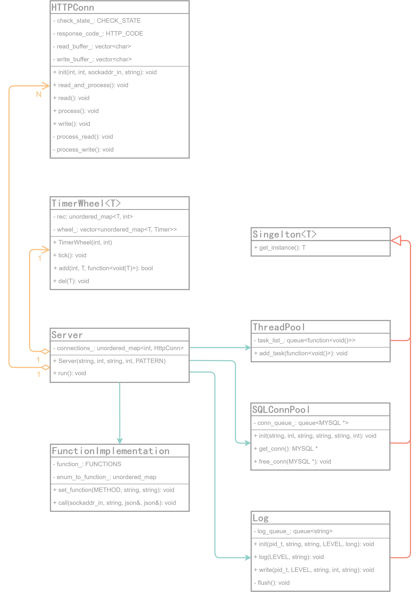

<h1 align = "center">TinyWebServer </h1>  

## Demo展示
  
<br>__部署于[webserver.jvlla.com](http://webserver.jvlla.com)，可实际体验__

## 技术特点
1. 基于循环监听epoll事件实现了简单的Web服务器，具备Reactor和Proactor两种事件处理模式
2. 基于有限状态机，完成了http报文解析，能够进行HTTP请求的读取和分析
3. 解决了大文件的接收和发送问题
4. 将网站具体功能实现封装于FunctionImplementation类中，便于业务逻辑的实现和修改
5. 使用Ajax制作了较为美观的简单网页前端，通过在HTTP报文实体主体中传递JSON格式数据与后端交互
6. 实现了线程池以并发响应HTTP请求，实现了连接池以复用MySQL连接
7. 实现了基于时间轮的定时器，以定时清理非活动连接
8. 实现了分级的异步日志，在缓冲队列写满后，由日志线程分日期写出至文件
9. 充分使用C++特性，包括但不限于STL、智能指针、C++多线程、lambda表达式、function、析构函数、继承和模板等
10. 实际部署，解决了真实环境下产生的多个bug，可以长时间稳定运行

## 实现说明
### 流程图（Proactor模式）
<div align="center">
	
</div>  

### UML类图
<div align="center">
	
</div>  

## 编译及使用
### 为什么选择此版本
- 封装优雅适度，前端简单易懂，便于阅读改造
- 注释充分合理，进一步理解游双书的不二之选
- 使用C++特性，实战面试八股
### 使用环境
Ubuntu 20.04 LTS
### 准备
安装、启动MySQL  
```
sudo apt install mysql-server mysql-client
sudo service mysql start
```
连接MySQL，设置用户名及密码（记得在主函数中相应修改），执行default.sql

### 编译
```
make
```
### 运行
```
./webServer IP 端口
```
